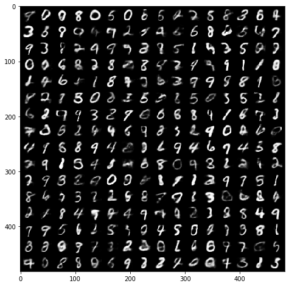
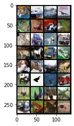
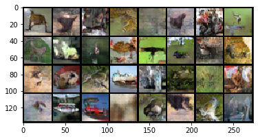

# Generative Models

Generative Adversarial Network and Variational AutoEncoder implementation in PyTorch. This implemenation relies solely on the following libraries:

````
numpy
torch
torchvision
````


## Variational Autoencoder

The VAE network was evaluated on the MNIST digit dataset.



The following animation shows the inference of the VAE network after every epoch completion during 50 epochs.


You can find the 50 original images in ``` /VAE/results/reconstructions ```


## Generative Adversarial Network

The GAN network was evaluated on the CIFAR-10 dataset. 

 


The following figure shows a generation batch after training the GAN for 60 epochs.

 
     
### Discussion

##### Architecture Design


- The baseline score was obtained with the **encoder-decoder architecture** of the VAE. This architecture was made of **linear** layers and a low latent dimension size. Even though it converges, the generated images are not convincing and fail to differ from a mean representation.

*Indeed, the CIFAR dataset shows rather images with background and multiple class objects which are far more complex than the MNIST digits from part I. These data require a contextual analysis of pixels. 2D Convolutions analyses relationship between neighboring pixels. These convolutions are key to understand the different classes of images of the CIFAR dataset.*

- The current GAN implementaion follows the **DCGAN** architecture. The **Generator** is made of three blocks of 2D Transpose Convolutions with Batch Normalization and Leaky Relu. The last layer was a Tanh activation layer. The **Decoder** Architecture is almost the same with classic convolution instead. The downsampling by  maxpooling on a 2x2 window showed better results than 2-strided convolutions. Unfortunately, it shows inconsistent results: the discrimator is getting too good and the generator fails to innovate. Therefore, one should perform an hyperparameters optimization.

##### Effect of Hyperparameters:

**Batch_size** as an impact on how fast the discriminator and generator learn. With smaller batchs, the reconstruction loss decreases fast which cause diminishing gradient : the discriminator is really good and therefore the generator cannot learn since the gradient is almost null).
**Number of epochs**: As the various images shows, the learning is rather low and require hundreds of epochs to be satisfaying. 
**Beta**: as discussed in part 1, we stick with the standart beta value to avoid posterior collapse.
**Nb_filters** : after grid search: 32 seems to be optimal.

##### Mode Collapse

A **mode collapse** is observed when the generator produces limited varieties of samples. This means that the generator gets specialize in one type of images to reduce its los and not take risks. To observe mode collapse, we should observe the generated fixed_noise image generated during the training and check the diversity of it.

From the images, one can see variety of :
**Color**: green, red, white and blue mainly.
**Classes**: cats, horses, birds. Our model focuses on animals and does not aim a lot at ships, and trucks. Nevertheless, these classes appears mostly in last epochs.
**Shapes** : within the generated class 'cats', one can observe different type of posture which indicates that the generator took risks and understood the data distribution  of cats fully.

In order to reduce this classes mode collapse, we should train our models for more epochs as it may seems that airplane and ships distribution are more difficult to grasp.
